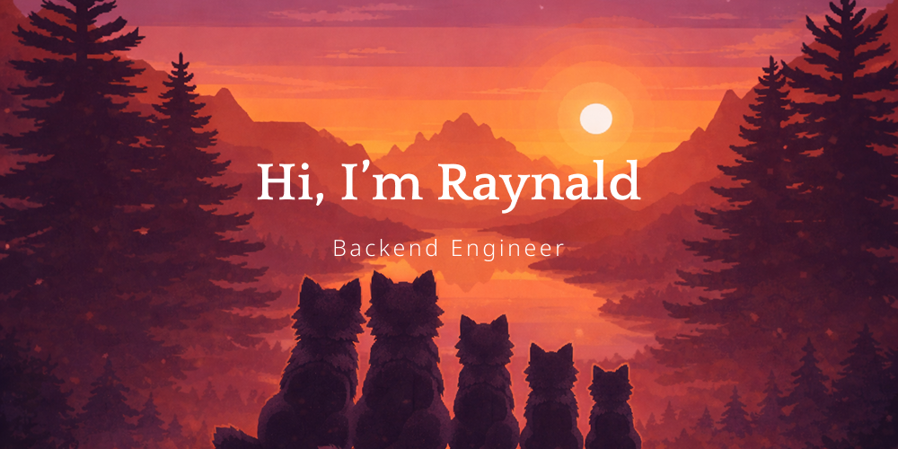

  

<h2 align="center">🧰 Technology Stack 🛠️</h2>

  
  
  
  
  
  
  
  
  
  
  
  
  
  
  
  
  
  
  
  

<h2 align="center">📊 My GitHub Stats 🧠</h2>

  
  

  
  

---

  
  

---

<h2 align="center">🔗 Connect Together 👍</h2>

  
  
  
  

  

  

